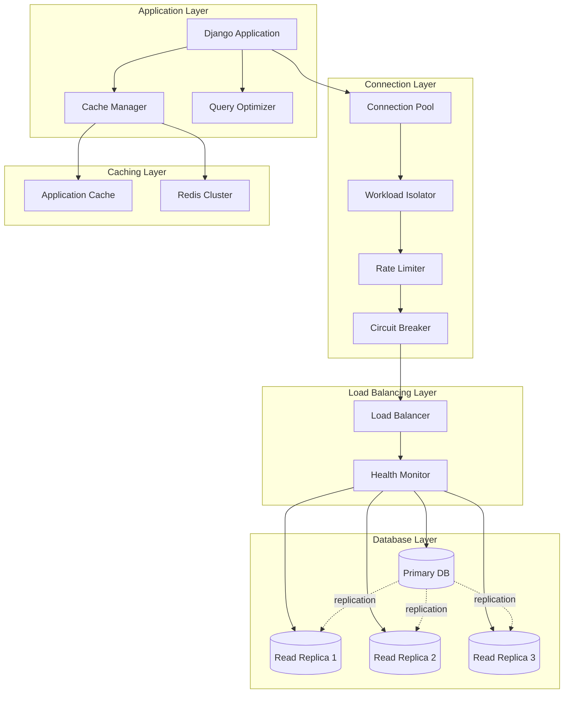

# Design Document: Database and Caching Infrastructure Optimization

## Overview

This design outlines the architecture and implementation strategy for optimizing database and caching infrastructure in a Django/Python backend application using Prisma ORM with PostgreSQL and Redis. The solution implements a multi-layered approach to achieve high availability, reliability, and stability through intelligent query routing, connection management, caching strategies, and comprehensive monitoring.

The design follows a defense-in-depth strategy with multiple layers of optimization:
- Application-level query optimization and caching
- Connection pooling and workload isolation
- Database replication and load balancing
- Multi-layer rate limiting
- Automated failover and circuit breaking

## Architecture

### High-Level Architecture



### Component Interaction Flow

**Read Query Flow:**
1. Application checks Application Cache (L1)
2. If miss, checks Redis Cache (L2)
3. If miss, routes through Connection Pool → Workload Isolator → Rate Limiter → Circuit Breaker → Load Balancer → Read Replica
4. Result cached at both levels with appropriate TTL

**Write Query Flow:**
1. Routes through Connection Pool → Workload Isolator → Rate Limiter → Circuit Breaker → Primary Database
2. Invalidates related cache entries in both Application Cache and Redis
3. Replication propagates changes to Read Replicas

## Components and Interfaces

### 1. Query Optimizer

**Responsibility:** Analyze and optimize database queries for performance.

**Interface:**
```python
class QueryOptimizer:
    def analyze_query(self, query: str, params: dict) -> QueryAnalysis:
        """Analyze query execution plan and identify optimization opportunities"""
        pass
    
    def detect_n_plus_one(self, queries: List[str]) -> List[NPlusOnePattern]:
        """Detect N+1 query patterns in a request cycle"""
        pass
    
    def suggest_indexes(self, slow_queries: List[QueryLog]) -> List[IndexSuggestion]:
        """Suggest indexes based on slow query patterns"""
        pass
    
    def log_slow_query(self, query: str, execution_time: float, plan: dict) -> None:
        """Log slow queries with execution statistics"""
        pass
```

**Implementation Notes:**
- Integrates with Prisma query hooks to intercept queries
- Uses PostgreSQL EXPLAIN ANALYZE for execution plan analysis
- Maintains a sliding window of query statistics
- Threshold for slow queries: 100ms

### 2. Connection Pool Manager

**Responsibility:** Manage database connections efficiently with separate pools for read/write operations.

**Interface:**
```python
class ConnectionPoolManager:
    def __init__(self, min_connections: int = 10, max_connections: int = 50):
        self.read_pool: ConnectionPool = None
        self.write_pool: ConnectionPool = None
        self.min_connections = min_connections
        self.max_connections = max_connections
    
    def get_read_connection(self) -> Connection:
        """Get a connection from the read pool"""
        pass
    
    def get_write_connection(self) -> Connection:
        """Get a connection from the write pool"""
        pass
    
    def release_connection(self, conn: Connection) -> None:
        """Return connection to pool"""
        pass
    
    def close_idle_connections(self, idle_timeout: int = 300) -> int:
        """Close connections idle longer than timeout"""
        pass
    
    def get_pool_stats(self) -> PoolStats:
        """Get current pool utilization statistics"""
        pass
```

**Implementation Notes:**
- Uses pgbouncer or built-in connection pooling
- Separate pools for read (routing to replicas) and write (routing to primary)
- Pre-warming on application startup
- Exponential backoff on connection failures

### 3. Workload Isolator

**Responsibility:** Route queries to appropriate database instances based on operation type and priority.

**Interface:**
```python
class WorkloadIsolator:
    def route_query(self, query: Query, priority: Priority = Priority.NORMAL) -> DatabaseTarget:
        """Determine which database instance should handle the query"""
        pass
    
    def check_replica_lag(self, replica: str) -> float:
        """Check replication lag for a specific replica"""
        pass
    
    def should_route_to_primary(self, query: Query, replica_lag: float) -> bool:
        """Decide if query should go to primary despite being a read"""
        pass
```

**Implementation Notes:**
- Reads go to replicas, writes go to primary
- Critical operations use dedicated high-priority connections
- Falls back to primary if replica lag > 5 seconds
- Monitors replication lag continuously

### 4. Cache Manager

**Responsibility:** Implement multi-layer caching with Application Cache (L1) and Redis (L2).

**Interface:**
```python
class CacheManager:
    def __init__(self):
        self.l1_cache: LRUCache = None  # Application-level cache
        self.l2_cache: RedisClient = None  # Redis cache
    
    def get(self, key: str) -> Optional[Any]:
        """Get value from cache (checks L1 then L2)"""
        pass
    
    def set(self, key: str, value: Any, ttl: int, tags: List[str] = None) -> None:
        """Set value in both cache layers"""
        pass
    
    def invalidate(self, key: str) -> None:
        """Invalidate cache entry in both layers"""
        pass
    
    def invalidate_by_tags(self, tags: List[str]) -> None:
        """Invalidate all entries with specified tags"""
        pass
    
    def warm_cache(self, queries: List[CacheWarmQuery]) -> None:
        """Pre-populate cache with predictable queries"""
        pass
    
    def get_stats(self) -> CacheStats:
        """Get cache hit/miss rates and other metrics"""
        pass
```

**Implementation Notes:**
- L1: In-memory LRU cache (size: 1000 entries, TTL: 60s)
- L2: Redis with configurable TTL per query type
- Tag-based invalidation for related data
- Write-through caching for critical data
- Cache warming on application startup

### 5. Rate Limiter

**Responsibility:** Protect database from overload with multi-layer rate limiting.

**Interface:**
```python
class RateLimiter:
    def check_user_limit(self, user_id: str) -> RateLimitResult:
        """Check per-user rate limit"""
        pass
    
    def check_global_limit(self) -> RateLimitResult:
        """Check global system rate limit"""
        pass
    
    def allow_request(self, user_id: str, is_admin: bool = False) -> bool:
        """Determine if request should be allowed"""
        pass
    
    def get_limit_info(self, user_id: str) -> LimitInfo:
        """Get current limit status for user"""
        pass
```

**Implementation Notes:**
- Sliding window algorithm for accurate rate limiting
- Per-user limits: 100 queries/minute
- Global limits: 10,000 queries/minute
- Admin bypass capability
- Implemented using Redis for distributed rate limiting

### 6. Load Balancer

**Responsibility:** Distribute read queries across healthy replicas.

**Interface:**
```python
class LoadBalancer:
    def __init__(self):
        self.replicas: List[ReplicaInfo] = []
        self.health_monitor: HealthMonitor = None
    
    def select_replica(self) -> str:
        """Select best replica for next query using weighted round-robin"""
        pass
    
    def update_replica_weight(self, replica: str, cpu_util: float, response_time: float) -> None:
        """Adjust replica weight based on performance metrics"""
        pass
    
    def mark_unhealthy(self, replica: str) -> None:
        """Remove replica from active pool"""
        pass
    
    def mark_healthy(self, replica: str) -> None:
        """Add replica back to active pool"""
        pass
```

**Implementation Notes:**
- Weighted round-robin based on CPU utilization and response time
- Reduces traffic to replicas at >80% CPU
- Removes unhealthy replicas from pool
- Falls back to primary if all replicas unhealthy

### 7. Health Monitor

**Responsibility:** Monitor database instance health and trigger failover.

**Interface:**
```python
class HealthMonitor:
    def check_health(self, instance: str) -> HealthStatus:
        """Perform health check on database instance"""
        pass
    
    def monitor_replication_lag(self, replica: str) -> float:
        """Monitor replication lag for replica"""
        pass
    
    def trigger_failover(self) -> None:
        """Initiate failover to promote replica to primary"""
        pass
    
    def notify_administrators(self, event: HealthEvent) -> None:
        """Send alerts to administrators"""
        pass
```

**Implementation Notes:**
- Health checks every 10 seconds
- Monitors: connectivity, replication lag, CPU, memory, disk
- Automatic failover within 30 seconds of primary failure
- Alerts via configured channels (email, Slack, PagerDuty)

### 8. Circuit Breaker

**Responsibility:** Prevent cascading failures by breaking circuit on repeated connection failures.

**Interface:**
```python
class CircuitBreaker:
    def __init__(self):
        self.state: CircuitState = CircuitState.CLOSED
        self.failure_count: int = 0
        self.last_failure_time: float = 0
    
    def call(self, func: Callable, *args, **kwargs) -> Any:
        """Execute function with circuit breaker protection"""
        pass
    
    def record_success(self) -> None:
        """Record successful operation"""
        pass
    
    def record_failure(self) -> None:
        """Record failed operation"""
        pass
    
    def should_attempt_reset(self) -> bool:
        """Check if circuit should attempt to close"""
        pass
```

**Implementation Notes:**
- Opens circuit at 50% failure rate over 60 seconds
- Half-open state after 30 seconds for test connection
- Exponential backoff: 1s, 2s, 4s retry delays
- Separate circuit breakers for read and write pools

### 9. Schema Manager

**Responsibility:** Manage database schema versions and migrations safely.

**Interface:**
```python
class SchemaManager:
    def apply_migration(self, migration: Migration, environment: str) -> MigrationResult:
        """Apply migration within transaction"""
        pass
    
    def rollback_migration(self, migration_id: str) -> MigrationResult:
        """Rollback a previously applied migration"""
        pass
    
    def validate_migration(self, migration: Migration) -> ValidationResult:
        """Validate migration in staging environment"""
        pass
    
    def get_version_history(self) -> List[MigrationRecord]:
        """Get history of all applied migrations"""
        pass
    
    def generate_rollback_script(self, migration: Migration) -> str:
        """Generate rollback script for migration"""
        pass
```

**Implementation Notes:**
- Uses Prisma Migrate for schema management
- All migrations run in transactions
- Automatic rollback on failure
- Staging validation before production
- Version history stored in migrations table

## Data Models

### Query Log Entry
```python
@dataclass
class QueryLog:
    query_id: str
    query_text: str
    execution_time: float
    timestamp: datetime
    execution_plan: dict
    parameters: dict
    user_id: Optional[str]
    app_name: str
```

### Replica Info
```python
@dataclass
class ReplicaInfo:
    host: str
    port: int
    weight: float
    is_healthy: bool
    cpu_utilization: float
    avg_response_time: float
    replication_lag: float
    last_health_check: datetime
```

### Cache Entry
```python
@dataclass
class CacheEntry:
    key: str
    value: Any
    ttl: int
    tags: List[str]
    created_at: datetime
    access_count: int
```

### Connection Pool Stats
```python
@dataclass
class PoolStats:
    total_connections: int
    active_connections: int
    idle_connections: int
    utilization_percent: float
    wait_time_avg: float
    connection_errors: int
```

### Health Status
```python
@dataclass
class HealthStatus:
    instance: str
    is_healthy: bool
    cpu_percent: float
    memory_percent: float
    disk_percent: float
    replication_lag: Optional[float]
    last_check: datetime
    error_message: Optional[str]
```

## Correctness Properties

*A property is a characteristic or behavior that should hold true across all valid executions of a system—essentially, a formal statement about what the system should do. Properties serve as the bridge between human-readable specifications and machine-verifiable correctness guarantees.*

### Property 1: Query Analysis Coverage
*For any* query executed through the system, the Query_Optimizer should analyze its execution plan and maintain performance metrics.
**Validates: Requirements 1.1, 1.4**

### Property 2: Slow Query Logging
*For any* query with execution time exceeding 100ms, the Database_System should log the query with complete execution statistics including the execution plan.
**Validates: Requirements 1.2, 10.3**

### Property 3: Index Suggestion Accuracy
*For any* set of slow queries analyzed, the Query_Optimizer should identify missing indexes that would improve performance based on query patterns.
**Validates: Requirements 1.3**

### Property 4: N+1 Detection
*For any* sequence of queries in a request cycle, if an N+1 pattern exists, the Query_Optimizer should detect it and recommend batch loading strategies.
**Validates: Requirements 1.5**

### Property 5: Automatic Failover Timing
*For any* Primary_Database failure event, the Database_System should promote a Read_Replica to primary within 30 seconds and notify administrators.
**Validates: Requirements 2.1, 2.5**

### Property 6: Replica Redundancy Invariant
*At any* point in time, the Database_System should maintain at least two Read_Replica instances for redundancy.
**Validates: Requirements 2.2**

### Property 7: Unhealthy Instance Removal
*For any* database instance that becomes unhealthy, the Load_Balancer should immediately remove it from the active pool.
**Validates: Requirements 2.3**

### Property 8: Health Check Frequency
*For any* 10-second time window, the Database_System should perform health checks on all database instances.
**Validates: Requirements 2.4**

### Property 9: Write Routing to Primary
*For any* write operation, the Workload_Isolator should route it to the Primary_Database.
**Validates: Requirements 3.1**

### Property 10: Read Routing to Replicas
*For any* read operation where replica lag is below 5 seconds, the Workload_Isolator should route it to Read_Replica instances.
**Validates: Requirements 3.2, 3.4**

### Property 11: Critical Operation Priority
*For any* operation flagged as critical, the Workload_Isolator should route it through dedicated high-priority connections.
**Validates: Requirements 3.3**

### Property 12: Separate Connection Pools
*At any* point in time, the Workload_Isolator should maintain separate connection pools for read and write operations.
**Validates: Requirements 3.5**

### Property 13: Connection Pool Bounds
*For any* application instance at any time, the Connection_Pool should maintain between 10 and 50 connections (inclusive).
**Validates: Requirements 4.1**

### Property 14: Idle Connection Cleanup
*For any* connection that has been idle for more than 300 seconds, the Connection_Pool should close it.
**Validates: Requirements 4.2**

### Property 15: Pool Utilization Warnings
*For any* time when connection pool utilization exceeds 80%, the Connection_Pool should log a warning.
**Validates: Requirements 4.3**

### Property 16: Exponential Backoff on Failures
*For any* sequence of connection failures, the Connection_Pool should implement exponential backoff with delays following the pattern 1s, 2s, 4s, etc.
**Validates: Requirements 4.4**

### Property 17: Query Result Caching
*For any* query result, the Cache_Layer should cache it in Redis with the configured TTL value.
**Validates: Requirements 5.1**

### Property 18: LRU Cache Behavior
*For any* sequence of cache accesses, the Application_Cache should maintain LRU eviction order, evicting the least recently used item when capacity is reached.
**Validates: Requirements 5.2**

### Property 19: Cache Hit Avoids Database
*For any* cached data request, the Cache_Layer should return the cached value without querying the database.
**Validates: Requirements 5.3**

### Property 20: Cache Invalidation on Modification
*For any* data modification operation, the Cache_Layer should invalidate all related cache entries in both L1 and L2 caches.
**Validates: Requirements 5.4, 12.1**

### Property 21: Write Replication
*For any* write operation on the Primary_Database, the Database_System should replicate it to all Read_Replica instances.
**Validates: Requirements 6.1**

### Property 22: Replication Lag Bounds
*For any* measurement under normal load conditions, replication lag should be below 2 seconds.
**Validates: Requirements 6.2**

### Property 23: Replication Lag Alerts
*For any* scenario where replication lag exceeds 5 seconds, the Database_System should alert administrators.
**Validates: Requirements 6.3**

### Property 24: Replica Capacity Support
*At any* point in time, the Database_System should support at least 3 Read_Replica instances in its configuration.
**Validates: Requirements 6.4**

### Property 25: Automatic Replica Resync
*For any* Read_Replica that falls behind in replication, the Database_System should automatically initiate resync from the Primary_Database.
**Validates: Requirements 6.5**

### Property 26: Per-User Rate Limiting
*For any* user making queries, the Rate_Limiter should enforce per-user rate limits at the application level.
**Validates: Requirements 7.1**

### Property 27: Global Rate Limiting
*For any* set of queries across all users, the Rate_Limiter should enforce global query rate limits at the database connection level.
**Validates: Requirements 7.2**

### Property 28: Rate Limit Error Response
*For any* request that exceeds rate limits, the Rate_Limiter should return a descriptive error without querying the database.
**Validates: Requirements 7.3**

### Property 29: Sliding Window Rate Limiting
*For any* configured time window, the Rate_Limiter should implement sliding window algorithm correctly, counting requests within the moving time window.
**Validates: Requirements 7.4**

### Property 30: Admin Rate Limit Bypass
*For any* administrative operation, the Rate_Limiter should allow bypass of standard rate limits.
**Validates: Requirements 7.5**

### Property 31: Schema Version History
*For any* schema change applied, the Schema_Manager should record it in the version history.
**Validates: Requirements 8.1**

### Property 32: Transactional Migrations
*For any* migration applied, the Schema_Manager should execute it within a transaction.
**Validates: Requirements 8.2**

### Property 33: Migration Rollback on Failure
*For any* migration that fails during execution, the Schema_Manager should rollback all changes and restore the previous database state.
**Validates: Requirements 8.3**

### Property 34: Rollback Script Generation
*For any* forward migration, the Schema_Manager should generate a corresponding rollback script.
**Validates: Requirements 8.5**

### Property 35: Load Distribution Across Replicas
*For any* set of read queries, the Load_Balancer should distribute them across all healthy Read_Replica instances using weighted round-robin based on replica capacity.
**Validates: Requirements 9.1, 9.2**

### Property 36: Traffic Reduction on High CPU
*For any* Read_Replica reaching 80% CPU utilization, the Load_Balancer should reduce traffic to that instance.
**Validates: Requirements 9.3**

### Property 37: Response Time Preference
*For any* set of replicas with different response times, the Load_Balancer should prefer routing queries to faster replicas.
**Validates: Requirements 9.4**

### Property 38: Database Metrics Exposure
*For any* query executed, the Database_System should expose metrics for query latency, throughput, and error rates.
**Validates: Requirements 10.1**

### Property 39: Cache Metrics Exposure
*For any* cache operation, the Cache_Layer should track and expose metrics for hit rate, miss rate, and eviction rate.
**Validates: Requirements 10.2**

### Property 40: Threshold Breach Alerts
*For any* critical threshold breach, the Database_System should trigger alerts to administrators.
**Validates: Requirements 10.4**

### Property 41: Connection Retry with Backoff
*For any* database connection failure, the Connection_Pool should retry with exponential backoff up to 3 attempts before giving up.
**Validates: Requirements 11.1**

### Property 42: Circuit Breaker State Machine
*For any* connection pool, the circuit breaker should follow this state machine: when failure rate exceeds 50% over 60 seconds, open the circuit; while open, reject all connection attempts immediately; after 30 seconds open, attempt a test connection; if test succeeds, close the circuit and resume normal operation.
**Validates: Requirements 11.2, 11.3, 11.4, 11.5**

### Property 43: Tag-Based Cache Invalidation
*For any* set of cache entries with common tags, the Cache_Layer should support invalidating all entries by tag.
**Validates: Requirements 12.2**

### Property 44: Cache Invalidation Failure Handling
*For any* cache invalidation that fails, the Cache_Layer should log the failure and set a short TTL on affected entries as a fallback.
**Validates: Requirements 12.3**

### Property 45: Write-Through Caching
*For any* critical data write operation, the Cache_Layer should implement write-through caching, updating both cache and database.
**Validates: Requirements 12.4**

### Property 46: Pattern-Based Cache Invalidation
*For any* pattern-based invalidation request, the Cache_Layer should invalidate all cache entries matching the pattern.
**Validates: Requirements 12.5**


## Error Handling

### Connection Failures

**Strategy:** Multi-layered retry with circuit breaker pattern

**Handling:**
1. Initial connection failure triggers exponential backoff retry (1s, 2s, 4s)
2. After 3 failed attempts, connection attempt fails
3. Circuit breaker monitors failure rate over 60-second window
4. At 50% failure rate, circuit opens and rejects new attempts immediately
5. After 30 seconds, circuit attempts test connection
6. Successful test closes circuit; failed test keeps it open

**User Impact:** Requests fail fast when circuit is open, preventing cascading failures

### Query Timeout

**Strategy:** Configurable timeout with graceful degradation

**Handling:**
1. Set query timeout at 30 seconds for normal queries, 60 seconds for critical queries
2. On timeout, cancel query at database level
3. Log timeout with query details for analysis
4. Return timeout error to application with retry guidance

**User Impact:** Prevents long-running queries from blocking connections

### Replication Lag

**Strategy:** Automatic fallback to primary database

**Handling:**
1. Monitor replication lag continuously
2. When lag exceeds 5 seconds, route reads to primary
3. Alert administrators of high lag
4. Resume routing to replicas when lag drops below 2 seconds

**User Impact:** Users may see slightly slower reads during high lag, but data consistency is maintained

### Cache Failures

**Strategy:** Fail-open with database fallback

**Handling:**
1. On Redis connection failure, bypass cache and query database directly
2. Log cache failure for monitoring
3. Implement circuit breaker for cache layer
4. Continue serving requests from database while cache is unavailable

**User Impact:** Increased database load during cache outage, but no service disruption

### Migration Failures

**Strategy:** Automatic rollback with state preservation

**Handling:**
1. All migrations run in transactions
2. On any error, rollback transaction automatically
3. Log failure details with stack trace
4. Preserve pre-migration database state
5. Alert administrators of failed migration

**User Impact:** Database remains in consistent state; no partial migrations

### Rate Limit Exceeded

**Strategy:** Descriptive error with retry guidance

**Handling:**
1. Return HTTP 429 (Too Many Requests) status
2. Include Retry-After header with wait time
3. Provide descriptive error message
4. Do not query database

**User Impact:** Clear feedback on rate limits with guidance on when to retry

### Failover Scenarios

**Strategy:** Automated promotion with health monitoring

**Handling:**
1. Health monitor detects primary failure
2. Select healthiest replica based on lag, CPU, and connectivity
3. Promote replica to primary within 30 seconds
4. Update connection routing to new primary
5. Notify administrators of failover event
6. Monitor new primary for stability

**User Impact:** Brief service interruption (< 30 seconds) during failover

## Testing Strategy

### Overview

The testing strategy employs a dual approach combining unit tests for specific scenarios and property-based tests for universal correctness properties. This ensures both concrete edge cases and general system behavior are validated.

### Property-Based Testing

**Framework:** Hypothesis (Python)

**Configuration:**
- Minimum 100 iterations per property test
- Each test tagged with feature name and property number
- Tag format: `# Feature: db-cache-optimization, Property N: [property text]`

**Property Test Coverage:**

**Query Optimization (Properties 1-4):**
- Generate random queries with varying complexity
- Test query analysis, slow query logging, index suggestions, N+1 detection
- Verify metrics collection for all queries

**High Availability (Properties 5-8):**
- Simulate primary failures and verify failover timing
- Test replica redundancy maintenance
- Verify health check frequency and unhealthy instance removal

**Workload Isolation (Properties 9-12):**
- Generate random read/write workloads
- Verify correct routing based on operation type and priority
- Test replica lag fallback behavior

**Connection Pooling (Properties 13-16):**
- Test pool bounds under varying load
- Verify idle connection cleanup
- Test exponential backoff with simulated failures

**Caching (Properties 17-20, 43-46):**
- Generate random cache access patterns
- Verify LRU eviction behavior
- Test cache invalidation on modifications
- Verify tag-based and pattern-based invalidation

**Replication (Properties 21-25):**
- Test write replication to all replicas
- Verify replication lag monitoring and alerts
- Test automatic resync behavior

**Rate Limiting (Properties 26-30):**
- Generate request patterns exceeding limits
- Verify sliding window algorithm correctness
- Test admin bypass functionality

**Schema Management (Properties 31-34):**
- Generate random migrations
- Test transactional execution and rollback
- Verify version history maintenance

**Load Balancing (Properties 35-37):**
- Generate varying replica loads
- Test weighted distribution algorithm
- Verify traffic reduction on high CPU

**Monitoring (Properties 38-40):**
- Verify metrics exposure for all operations
- Test alert triggering on threshold breaches

**Circuit Breaking (Properties 41-42):**
- Simulate connection failure patterns
- Test state machine transitions
- Verify retry behavior with backoff

### Unit Testing

**Focus Areas:**

**Specific Examples:**
- Application startup with connection pool pre-warming
- Cache warming with predictable queries
- Specific failover scenarios (primary crash, network partition)
- Edge case: all replicas unhealthy (fallback to primary)

**Integration Points:**
- Prisma ORM integration with query optimizer
- Redis integration with cache manager
- PostgreSQL replication setup
- Health monitoring integration with load balancer

**Edge Cases:**
- Empty query results
- Zero replication lag
- Single replica configuration
- Cache invalidation during write failures
- Migration with no changes

**Error Conditions:**
- Connection pool exhaustion
- Redis unavailability
- All replicas down
- Migration syntax errors
- Invalid rate limit configuration

### Test Organization

```
tests/
├── unit/
│   ├── test_query_optimizer.py
│   ├── test_connection_pool.py
│   ├── test_workload_isolator.py
│   ├── test_cache_manager.py
│   ├── test_rate_limiter.py
│   ├── test_load_balancer.py
│   ├── test_health_monitor.py
│   ├── test_circuit_breaker.py
│   └── test_schema_manager.py
├── property/
│   ├── test_query_properties.py
│   ├── test_availability_properties.py
│   ├── test_workload_properties.py
│   ├── test_connection_properties.py
│   ├── test_cache_properties.py
│   ├── test_replication_properties.py
│   ├── test_rate_limit_properties.py
│   ├── test_schema_properties.py
│   ├── test_load_balance_properties.py
│   └── test_circuit_breaker_properties.py
├── integration/
│   ├── test_end_to_end_read_flow.py
│   ├── test_end_to_end_write_flow.py
│   ├── test_failover_scenarios.py
│   └── test_cache_invalidation_flow.py
└── performance/
    ├── test_query_performance.py
    ├── test_connection_pool_scaling.py
    └── test_cache_hit_rates.py
```

### Test Data Generation

**Generators for Property Tests:**
- Random queries (SELECT, INSERT, UPDATE, DELETE)
- Random database instances with varying health metrics
- Random cache keys and values with tags
- Random user IDs for rate limiting
- Random migrations with DDL statements
- Random workload patterns (read-heavy, write-heavy, mixed)

### Continuous Integration

**CI Pipeline:**
1. Run unit tests on every commit
2. Run property tests (100 iterations) on every PR
3. Run integration tests on merge to main
4. Run performance tests nightly
5. Generate coverage reports (target: 85% coverage)

### Monitoring Test Results

**Metrics to Track:**
- Test execution time trends
- Property test failure rates
- Coverage percentage over time
- Flaky test identification
- Performance test regression detection
