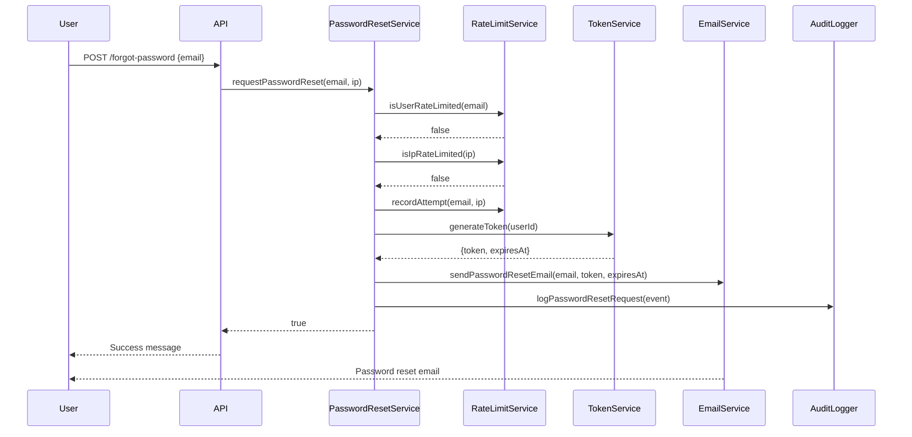
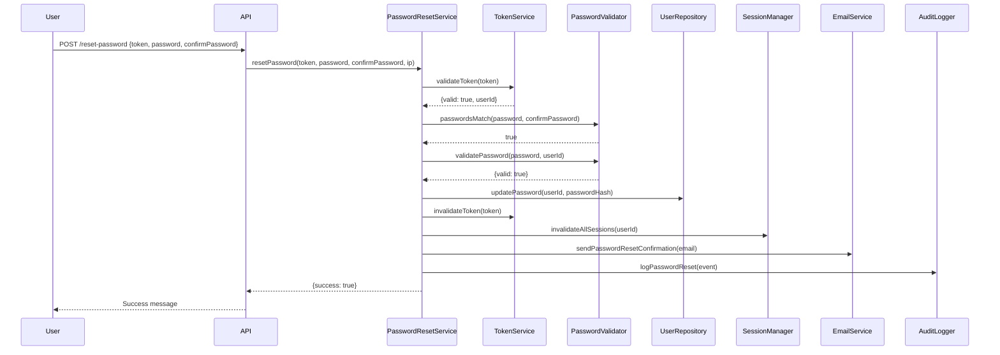

# Design Document: Forgot Password Feature

## Overview

The Forgot Password feature implements a secure, token-based password reset mechanism that allows users to regain access to their accounts through email verification. The design prioritizes security through cryptographically secure tokens, rate limiting, and comprehensive audit logging while maintaining a smooth user experience.

The system follows a standard password reset flow:
1. User requests password reset by submitting email
2. System generates secure token and sends email
3. User clicks link in email to access reset form
4. User submits new password with token validation
5. System updates password and invalidates all sessions

## Architecture

The system is organized into four main layers:

```
┌─────────────────────────────────────────────────────────┐
│                    Presentation Layer                    │
│  (Reset Request Form, Reset Password Form, Email UI)    │
└─────────────────────────────────────────────────────────┘
                           ↓
┌─────────────────────────────────────────────────────────┐
│                     Service Layer                        │
│  (PasswordResetService, TokenService, EmailService)     │
└─────────────────────────────────────────────────────────┘
                           ↓
┌─────────────────────────────────────────────────────────┐
│                   Data Access Layer                      │
│     (TokenRepository, UserRepository, AuditLogger)      │
└─────────────────────────────────────────────────────────┘
                           ↓
┌─────────────────────────────────────────────────────────┐
│                    Persistence Layer                     │
│        (Database, Cache, Logging System)                │
└─────────────────────────────────────────────────────────┘
```

### Key Architectural Decisions

1. **Token Storage**: Tokens are stored hashed in the database to prevent exposure if the database is compromised
2. **Rate Limiting**: Implemented at the service layer using a combination of user-based and IP-based limits stored in cache
3. **Email Delivery**: Asynchronous email sending to prevent blocking the request/response cycle
4. **Session Invalidation**: Centralized session management to ensure all active sessions are terminated on password reset

## Components and Interfaces

### PasswordResetService

The main orchestrator for password reset operations.

```typescript
interface PasswordResetService {
  /**
   * Initiates a password reset request
   * @param email - User's email address
   * @param ipAddress - Request origin IP for rate limiting
   * @returns Success indicator (always true to prevent email enumeration)
   */
  requestPasswordReset(email: string, ipAddress: string): Promise<boolean>
  
  /**
   * Validates a reset token
   * @param token - The reset token from the email link
   * @returns Token validation result with user context if valid
   */
  validateToken(token: string): Promise<TokenValidationResult>
  
  /**
   * Resets user password with token validation
   * @param token - The reset token
   * @param newPassword - The new password
   * @param confirmPassword - Password confirmation
   * @param ipAddress - Request origin IP for logging
   * @returns Success indicator and any validation errors
   */
  resetPassword(
    token: string,
    newPassword: string,
    confirmPassword: string,
    ipAddress: string
  ): Promise<ResetResult>
}
```

### TokenService

Handles token generation, validation, and lifecycle management.

```typescript
interface TokenService {
  /**
   * Generates a cryptographically secure token
   * @param userId - The user ID for whom the token is generated
   * @returns Token string and expiration timestamp
   */
  generateToken(userId: string): Promise<TokenData>
  
  /**
   * Validates token and checks expiration
   * @param token - The token to validate
   * @returns Validation result with user ID if valid
   */
  validateToken(token: string): Promise<TokenValidationResult>
  
  /**
   * Invalidates a specific token
   * @param token - The token to invalidate
   */
  invalidateToken(token: string): Promise<void>
  
  /**
   * Invalidates all tokens for a user
   * @param userId - The user ID
   */
  invalidateAllUserTokens(userId: string): Promise<void>
}
```

### RateLimitService

Enforces rate limits to prevent abuse.

```typescript
interface RateLimitService {
  /**
   * Checks if a user has exceeded rate limits
   * @param email - User's email address
   * @returns True if rate limit exceeded
   */
  isUserRateLimited(email: string): Promise<boolean>
  
  /**
   * Checks if an IP address has exceeded rate limits
   * @param ipAddress - The IP address
   * @returns True if rate limit exceeded
   */
  isIpRateLimited(ipAddress: string): Promise<boolean>
  
  /**
   * Records a password reset attempt
   * @param email - User's email address
   * @param ipAddress - Request origin IP
   */
  recordAttempt(email: string, ipAddress: string): Promise<void>
}
```

### EmailService

Handles email composition and delivery.

```typescript
interface EmailService {
  /**
   * Sends password reset email
   * @param email - Recipient email address
   * @param token - Reset token to include in link
   * @param expirationTime - Token expiration timestamp
   * @returns Success indicator
   */
  sendPasswordResetEmail(
    email: string,
    token: string,
    expirationTime: Date
  ): Promise<boolean>
  
  /**
   * Sends password reset confirmation email
   * @param email - Recipient email address
   * @returns Success indicator
   */
  sendPasswordResetConfirmation(email: string): Promise<boolean>
}
```

### PasswordValidator

Validates password strength and requirements.

```typescript
interface PasswordValidator {
  /**
   * Validates password meets security requirements
   * @param password - The password to validate
   * @param userId - User ID to check against previous passwords
   * @returns Validation result with specific error messages
   */
  validatePassword(password: string, userId: string): Promise<ValidationResult>
  
  /**
   * Checks if passwords match
   * @param password - The password
   * @param confirmPassword - The confirmation password
   * @returns True if passwords match
   */
  passwordsMatch(password: string, confirmPassword: string): boolean
}
```

### SessionManager

Manages user sessions and invalidation.

```typescript
interface SessionManager {
  /**
   * Invalidates all active sessions for a user
   * @param userId - The user ID
   */
  invalidateAllSessions(userId: string): Promise<void>
}
```

### AuditLogger

Records security-relevant events.

```typescript
interface AuditLogger {
  /**
   * Logs a password reset request
   * @param event - The audit event details
   */
  logPasswordResetRequest(event: AuditEvent): Promise<void>
  
  /**
   * Logs a token validation attempt
   * @param event - The audit event details
   */
  logTokenValidation(event: AuditEvent): Promise<void>
  
  /**
   * Logs a successful password reset
   * @param event - The audit event details
   */
  logPasswordReset(event: AuditEvent): Promise<void>
  
  /**
   * Logs a rate limit violation
   * @param event - The audit event details
   */
  logRateLimitViolation(event: AuditEvent): Promise<void>
}
```

## Data Models

### Token

Represents a password reset token in the database.

```typescript
interface Token {
  id: string                    // Unique token identifier
  userId: string                // Associated user ID
  tokenHash: string             // SHA-256 hash of the token
  expiresAt: Date              // Expiration timestamp
  createdAt: Date              // Creation timestamp
  usedAt: Date | null          // Timestamp when token was used (null if unused)
  invalidated: boolean         // Whether token has been manually invalidated
}
```

### User

Represents a user account (relevant fields for password reset).

```typescript
interface User {
  id: string                    // Unique user identifier
  email: string                 // User's email address
  passwordHash: string          // Hashed password
  previousPasswordHashes: string[] // Array of previous password hashes
  updatedAt: Date              // Last update timestamp
}
```

### RateLimitEntry

Tracks rate limiting attempts in cache.

```typescript
interface RateLimitEntry {
  key: string                   // Email or IP address
  attempts: number              // Number of attempts
  windowStart: Date            // Start of the rate limit window
  expiresAt: Date              // When the entry expires from cache
}
```

### AuditEvent

Represents a security audit log entry.

```typescript
interface AuditEvent {
  id: string                    // Unique event identifier
  eventType: AuditEventType    // Type of event
  userId: string | null        // User ID if applicable
  email: string | null         // Email address if applicable
  ipAddress: string            // Request origin IP
  timestamp: Date              // Event timestamp
  success: boolean             // Whether the operation succeeded
  metadata: Record<string, any> // Additional event-specific data
}

enum AuditEventType {
  PASSWORD_RESET_REQUESTED = 'PASSWORD_RESET_REQUESTED',
  TOKEN_VALIDATED = 'TOKEN_VALIDATED',
  PASSWORD_RESET_COMPLETED = 'PASSWORD_RESET_COMPLETED',
  RATE_LIMIT_EXCEEDED = 'RATE_LIMIT_EXCEEDED',
  INVALID_TOKEN_USED = 'INVALID_TOKEN_USED'
}
```

### TokenValidationResult

Result of token validation.

```typescript
interface TokenValidationResult {
  valid: boolean               // Whether token is valid
  userId: string | null       // User ID if token is valid
  reason: string | null       // Reason for invalidity if applicable
}
```

### ResetResult

Result of password reset operation.

```typescript
interface ResetResult {
  success: boolean             // Whether reset succeeded
  errors: string[]            // Array of error messages if any
}
```

### ValidationResult

Result of password validation.

```typescript
interface ValidationResult {
  valid: boolean               // Whether password is valid
  errors: string[]            // Array of validation error messages
}
```

## Implementation Flow

### Password Reset Request Flow



### Password Reset Completion Flow




## Correctness Properties

*A property is a characteristic or behavior that should hold true across all valid executions of a system—essentially, a formal statement about what the system should do. Properties serve as the bridge between human-readable specifications and machine-verifiable correctness guarantees.*

### Property 1: Token Generation and Storage

*For any* valid email address, when a password reset is requested, the system should generate a unique token and store it with an expiration timestamp exactly 1 hour from creation time.

**Validates: Requirements 1.1, 1.2, 2.2**

### Property 2: Email Delivery on Token Generation

*For any* generated password reset token, the email service should send an email containing that token to the associated email address.

**Validates: Requirements 1.3**

### Property 3: Email Enumeration Prevention

*For any* email address (whether associated with an account or not), the system should return identical success responses to prevent email enumeration attacks.

**Validates: Requirements 1.4**

### Property 4: Invalid Email Format Rejection

*For any* string that does not match valid email format patterns, the system should reject password reset requests and return a validation error.

**Validates: Requirements 1.5**

### Property 5: Token Cryptographic Security

*For any* set of generated tokens, each token should have at least 256 bits of entropy and exhibit cryptographically secure randomness (no predictable patterns).

**Validates: Requirements 2.1**

### Property 6: Expired Token Rejection

*For any* token that has passed its expiration timestamp, any password reset attempt using that token should be rejected.

**Validates: Requirements 2.3**

### Property 7: Single-Use Token Property

*For any* token that has been successfully used to reset a password, subsequent attempts to use that same token should be rejected.

**Validates: Requirements 2.4, 5.4**

### Property 8: Token Invalidation on New Generation

*For any* user with existing password reset tokens, when a new token is generated for that user, all previous tokens should become invalid.

**Validates: Requirements 2.5**

### Property 9: User-Based Rate Limiting

*For any* email address, when more than 3 password reset requests are made within a 1-hour period, the 4th and subsequent requests should be rejected until the time window expires.

**Validates: Requirements 3.1**

### Property 10: IP-Based Rate Limiting

*For any* IP address, when more than 10 password reset requests are made within a 1-hour period, the 11th and subsequent requests should be rejected until the time window expires.

**Validates: Requirements 3.3**

### Property 11: Rate Limit Window Expiration

*For any* rate-limited email or IP address, when the 1-hour time window expires, new password reset requests should be allowed.

**Validates: Requirements 3.4**

### Property 12: Valid Token Form Display

*For any* valid, non-expired, unused token, accessing the reset form with that token should display the password reset form.

**Validates: Requirements 4.1**

### Property 13: Invalid Token Error Response

*For any* token that is malformed or does not exist in the system, accessing the reset form should display an error message and offer to send a new reset email.

**Validates: Requirements 4.3**

### Property 14: Password Validation Enforcement

*For any* password submission with a valid token, the system should validate that the password meets all security requirements before accepting it.

**Validates: Requirements 5.1**

### Property 15: Password Update on Successful Reset

*For any* valid token and matching password/confirmation pair that meets security requirements, the system should update the user's password in the database.

**Validates: Requirements 5.2**

### Property 16: Password Confirmation Mismatch Rejection

*For any* password and confirmation password that do not match, the system should reject the submission and display an error message.

**Validates: Requirements 5.3**

### Property 17: Confirmation Email on Password Reset

*For any* successful password reset, the system should send a confirmation email to the user's email address.

**Validates: Requirements 5.5**

### Property 18: Minimum Password Length

*For any* password with fewer than 8 characters, the system should reject it during password reset.

**Validates: Requirements 6.1**

### Property 19: Password Complexity Requirements

*For any* password that lacks at least one uppercase letter, one lowercase letter, one number, or one special character, the system should reject it during password reset.

**Validates: Requirements 6.2**

### Property 20: Previous Password Rejection

*For any* user attempting to reset their password, if the new password matches their current password, the system should reject the submission.

**Validates: Requirements 6.3**

### Property 21: Weak Password Rejection

*For any* password containing common patterns or dictionary words, the system should reject it during password reset.

**Validates: Requirements 6.4**

### Property 22: Password Hashing Before Storage

*For any* successful password reset, the password stored in the database should be a hash, not the plaintext password.

**Validates: Requirements 6.5**

### Property 23: Password Reset Email Content Completeness

*For any* password reset email sent, the email should contain all required elements: a direct link with embedded token, reset instructions, token expiration time, and a security warning.

**Validates: Requirements 7.1, 7.2, 7.3, 7.4**

### Property 24: Email Send Failure Handling

*For any* password reset email that fails to send, the system should log the error and return an error message to the user.

**Validates: Requirements 7.5**

### Property 25: Session Invalidation on Password Reset

*For any* user with active sessions, when their password is successfully reset, all active sessions for that user should be invalidated.

**Validates: Requirements 8.1**

### Property 26: Session Token Removal

*For any* user whose sessions are invalidated, all session tokens for that user should be removed from the database.

**Validates: Requirements 8.3**

### Property 27: Password Reset Request Audit Logging

*For any* password reset request, the system should create an audit log entry containing the email address, timestamp, and IP address.

**Validates: Requirements 9.1**

### Property 28: Token Validation Audit Logging

*For any* token validation attempt, the system should create an audit log entry containing the token identifier, validation result, and timestamp.

**Validates: Requirements 9.2**

### Property 29: Password Reset Completion Audit Logging

*For any* successful password reset, the system should create an audit log entry containing the user account identifier, timestamp, and IP address.

**Validates: Requirements 9.3**

### Property 30: Rate Limit Violation Audit Logging

*For any* rate limit violation, the system should create an audit log entry containing the email address or IP address, timestamp, and rate limit type.

**Validates: Requirements 9.4**

## Error Handling

### Token Errors

1. **Expired Token**: Return user-friendly error message with option to request new reset email
2. **Invalid Token**: Return generic error message to prevent token enumeration
3. **Used Token**: Return specific error indicating token has already been used
4. **Missing Token**: Return validation error requiring token parameter

### Validation Errors

1. **Invalid Email Format**: Return specific validation error with format requirements
2. **Password Too Short**: Return error specifying minimum length requirement
3. **Password Lacks Complexity**: Return error listing missing complexity requirements
4. **Passwords Don't Match**: Return error indicating confirmation mismatch
5. **Weak Password**: Return error indicating password is too common or weak
6. **Same as Previous Password**: Return error indicating password must be different

### Rate Limiting Errors

1. **User Rate Limit Exceeded**: Return error with time remaining until next attempt allowed
2. **IP Rate Limit Exceeded**: Return error with time remaining until next attempt allowed

### System Errors

1. **Email Send Failure**: Log detailed error, return generic error to user
2. **Database Error**: Log detailed error, return generic error to user
3. **Token Generation Failure**: Log detailed error, return generic error to user

### Error Response Format

All errors should follow a consistent format:

```typescript
interface ErrorResponse {
  success: false
  error: {
    code: string           // Machine-readable error code
    message: string        // User-friendly error message
    details?: string[]     // Optional array of detailed error messages
    retryAfter?: number    // Optional seconds until retry allowed (for rate limiting)
  }
}
```

## Testing Strategy

### Dual Testing Approach

This feature requires both unit testing and property-based testing for comprehensive coverage:

- **Unit tests**: Verify specific examples, edge cases, and error conditions
- **Property tests**: Verify universal properties across all inputs

Both testing approaches are complementary and necessary. Unit tests catch concrete bugs in specific scenarios, while property tests verify general correctness across a wide range of inputs.

### Property-Based Testing

We will use **fast-check** (for TypeScript/JavaScript) as our property-based testing library. Each correctness property listed above must be implemented as a property-based test.

**Configuration Requirements**:
- Each property test must run a minimum of 100 iterations
- Each test must be tagged with a comment referencing the design property
- Tag format: `// Feature: forgot-password, Property {number}: {property_text}`

**Example Property Test Structure**:

```typescript
import fc from 'fast-check'

describe('Password Reset Properties', () => {
  it('Property 1: Token Generation and Storage', async () => {
    // Feature: forgot-password, Property 1: Token generation and storage
    await fc.assert(
      fc.asyncProperty(
        fc.emailAddress(),
        async (email) => {
          const result = await passwordResetService.requestPasswordReset(email, '127.0.0.1')
          const token = await tokenRepository.findLatestByEmail(email)
          
          expect(token).toBeDefined()
          expect(token.expiresAt).toEqual(
            new Date(token.createdAt.getTime() + 60 * 60 * 1000)
          )
        }
      ),
      { numRuns: 100 }
    )
  })
})
```

### Unit Testing Focus

Unit tests should focus on:

1. **Specific Examples**: Concrete scenarios that demonstrate correct behavior
   - Valid password reset flow with known test data
   - Specific error conditions with expected error messages

2. **Edge Cases**: Boundary conditions and special cases
   - Token exactly at expiration time
   - Empty string inputs
   - Maximum length inputs
   - Special characters in passwords

3. **Integration Points**: Component interactions
   - Email service integration
   - Database transaction handling
   - Cache synchronization

4. **Error Conditions**: Specific error scenarios
   - Database connection failures
   - Email service timeouts
   - Invalid token formats

### Test Coverage Goals

- **Line Coverage**: Minimum 90%
- **Branch Coverage**: Minimum 85%
- **Property Coverage**: 100% of correctness properties implemented as tests
- **Requirements Coverage**: 100% of testable acceptance criteria covered

### Testing Pyramid

```
    /\
   /  \      E2E Tests (5%)
  /____\     - Full password reset flow
 /      \    - Email delivery verification
/________\   
          \  Integration Tests (15%)
           \ - Component interactions
            \- Database operations
             \
              \ Unit Tests (50%)
               \- Individual functions
                \- Validation logic
                 \
                  \ Property Tests (30%)
                   \- Universal properties
                    \- Randomized inputs
```

### Security Testing

In addition to functional testing, security-specific tests must include:

1. **Token Security Tests**:
   - Verify token entropy and randomness
   - Test token expiration enforcement
   - Verify token invalidation

2. **Rate Limiting Tests**:
   - Test user-based rate limits
   - Test IP-based rate limits
   - Test rate limit window expiration

3. **Password Security Tests**:
   - Test password hashing
   - Test password complexity requirements
   - Test previous password rejection

4. **Session Security Tests**:
   - Test session invalidation on password reset
   - Test session token removal

5. **Audit Logging Tests**:
   - Verify all security events are logged
   - Test log integrity and completeness
